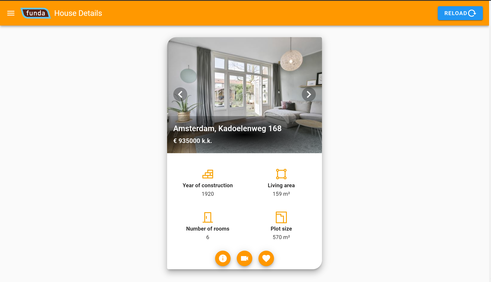
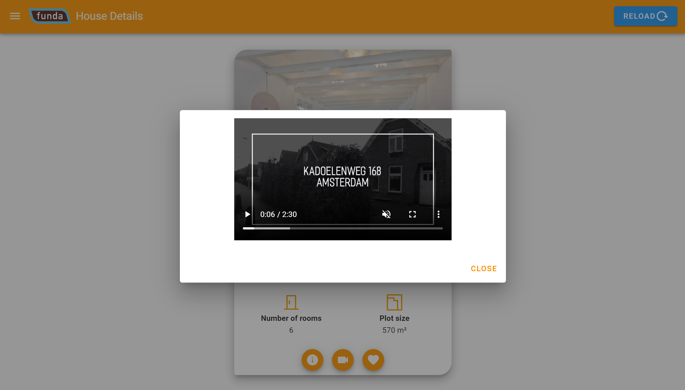
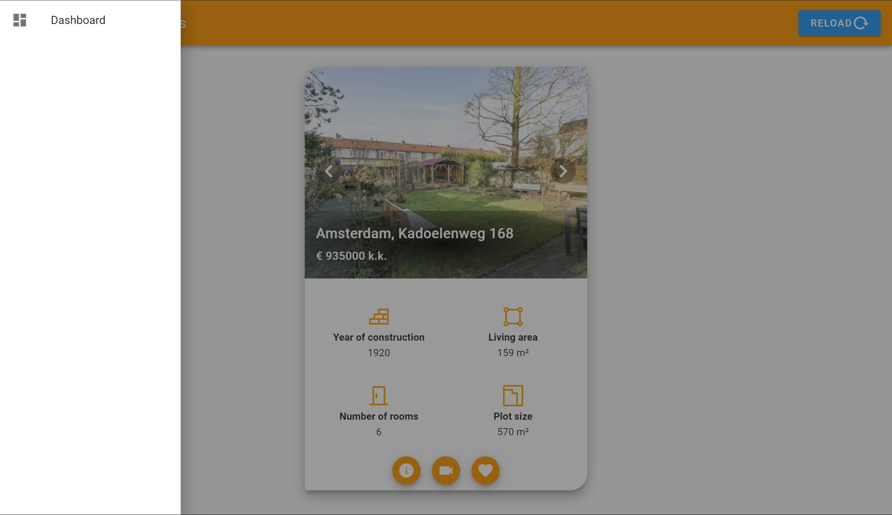
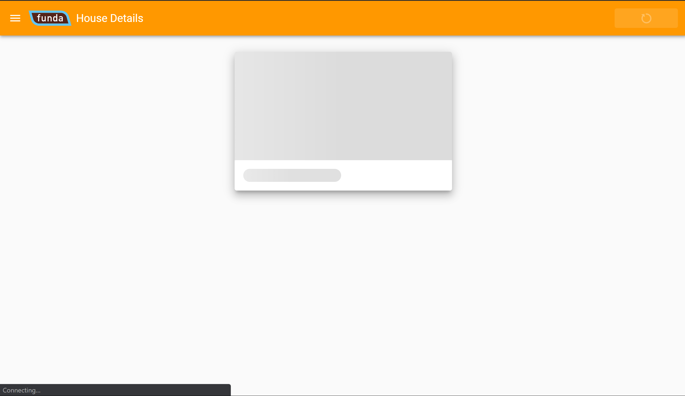

### Funda Application

#### Global pre-requisites
- [Node.js](https://nodejs.org/en/) (v12.x or higher, preferably latest LTS)
- [Vue CLI](https://www.npmjs.com/package/@vue/cli) (v4.0.5 or higher)

#### Getting started
Navigate to the repository's root directory and run the following commands:
```
npm install
npm run build
npm run serve
```

- The application is now running at [http://localhost:8080](http://localhost:8080)
- In case you want to see the application live [https://flamboyant-pasteur-a44926.netlify.com/](https://flamboyant-pasteur-a44926.netlify.com/)
- NOTE: For this app I used the keys on the Front-End side (it is not for production purposes)

### Demo images




